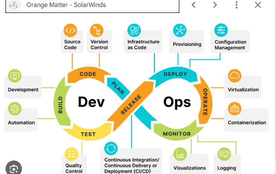
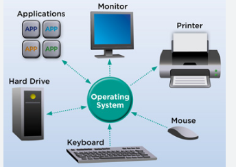
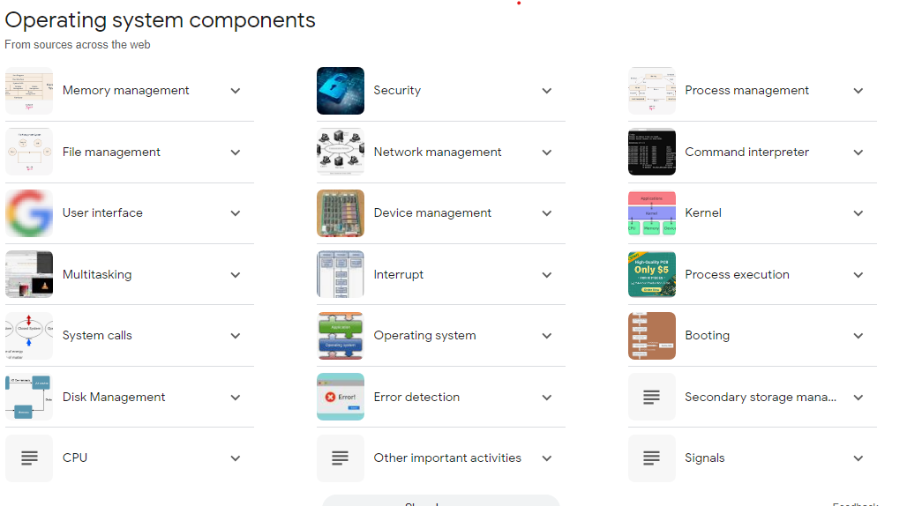
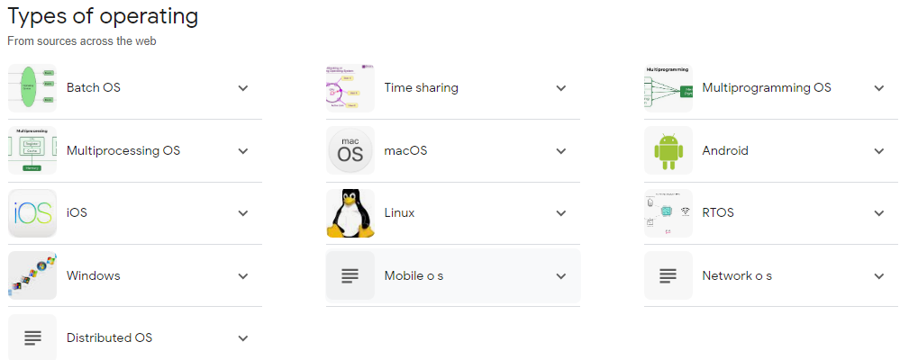
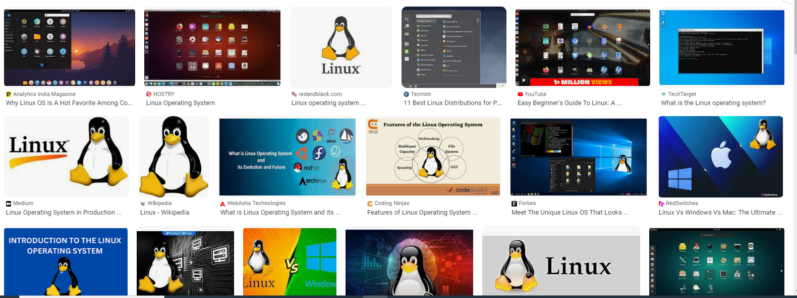

# Introduction-to-DevOps

## What is Devops

According to AWS DEDevOps Model Defined
DevOps is the combination of cultural philosophies, practices, and tools that increases an organization’s ability to deliver applications and services at high velocity: evolving and improving products at a faster pace than organizations using traditional software development and infrastructure management processes. This speed enables organizations to better serve their customers and compete more effectively in the market.

## {How DevOps Works}

Under a DevOps model, development and operations teams are no longer “siloed.” Sometimes, these two teams are merged into a single team where the engineers work across the entire application lifecycle, from development and test to deployment to operations, and develop a range of skills not limited to a single function.

In some DevOps models, quality assurance and security teams may also become more tightly integrated with development and operations and throughout the application lifecycle. When security is the focus of everyone on a DevOps team, this is sometimes referred to as DevSecOps.
These teams use practices to automate processes that historically have been manual and slow. They use a technology stack and tooling which help them operate and evolve applications quickly and reliably. These tools also help engineers independently accomplish tasks (for example, deploying code or provisioning infrastructure) that normally would have required help from other teams, and this further increases a team’s velocity.

## What is Operation System

An operating system (OS) is the program that, after being initially loaded into the computer by a boot program, manages all of the other application programs in a computer. The application programs make use of the operating system by making requests for services through a defined application program interface (API). In addition, users can interact directly with the operating system through a user interface, such as a command-line interface (CLI) or a graphical UI (GUI).

## Why use of an Operation System

An operating system brings powerful benefits to computer software and software development. Without an operating system, every application would need to include its own UI, as well as the comprehensive code needed to handle all low-level functionality of the underlying computer, such as disk storage, network interfaces and so on. Considering the vast array of underlying hardware available, this would vastly bloat the size of every application and make software development impractical.

Instead, many common tasks, such as sending a network packet or displaying text on a standard output device, such as a display, can be offloaded to system software that serves as an intermediary between the applications and the hardware. The system software provides a consistent and repeatable way for applications to interact with the hardware without the applications needing to know any details about the hardware.

As long as each application accesses the same resources and services in the same way, that system software -- the operating system -- can service almost any number of applications. This vastly reduces the amount of time and coding required to develop and debug an application, while ensuring that users can control, configure and manage the system hardware through a common and well-understood interface.

Note that we said that an operating system is a set of programs. The most important program in the operating system, the program that manages the operating system, is the supervisor program, most of which remains in memory and is thus referred to as resident. The supervisor controls the entire operating system and loads into memory other operating system programs (called nonresident) from disk storage only as needed.

## Task of an Operation System

An operating system has three main functions: (1) manage the computer's resources, such as the central processing unit, memory, disk drives, and printers, (2) establish a user interface, and (3) execute and provide services for applications software. Keep in mind, however, that much of the work of an operating system is hidden from the user; many necessary tasks are performed behind the scenes. In particular, the first listed function, managing the computer's resources, is taken care of without the user being aware of the details. Furthermore, all input and output operations, although invoked by an applications program, are actually carried out by the operating system. Although much of the operating system functions are hidden from view, you will know when you are using an applications software package, and this requires that you invoke-call into action-the operating system. Thus you both establish a user interface and execute software.

Operating systems for mainframe and other large computers are even more complex because they must keep track of several programs from several users all running in the same time frame. Although some personal computer operating systems-most often found in business or learning environments-can support multiple programs and users, most are concerned only with a single user. We begin by focusing on the interaction between a single user and a personal computer operating system.

There are various components of an Operating System to perform well defined tasks. Though most of the Operating Systems differ in structure but logically they have similar components. Each component must be a well-defined portion of a system that appropriately describes the functions, inputs, and outputs.

## component an Operation System

There are following 8-components of an Operating System:

Process Management
I/O Device Management
File Management
Network Management
Main Memory Management
Secondary Storage Management
Security Management
Command Interpreter System
Following section explains all the above components in more detail:

Process Management
A process is program or a fraction of a program that is loaded in main memory. A process needs certain resources including CPU time, Memory, Files, and I/O devices to accomplish its task. The process management component manages the multiple processes running simultaneously on the Operating System.

A program in running state is called a process.
The operating system is responsible for the following activities in connection with process management:

Create, load, execute, suspend, resume, and terminate processes.
Switch system among multiple processes in main memory.
Provides communication mechanisms so that processes can communicate with each others
Provides synchronization mechanisms to control concurrent access to shared data to keep shared data consistent.
Allocate/de-allocate resources properly to prevent or avoid deadlock situation.
I/O Device Management
One of the purposes of an operating system is to hide the peculiarities of specific hardware devices from the user. I/O Device Management provides an abstract level of H/W devices and keep the details from applications to ensure proper use of devices, to prevent errors, and to provide users with convenient and efficient programming environment.

Following are the tasks of I/O Device Management component:

Hide the details of H/W devices
Manage main memory for the devices using cache, buffer, and spooling
Maintain and provide custom drivers for each device.
File Management
File management is one of the most visible services of an operating system. Computers can store information in several different physical forms; magnetic tape, disk, and drum are the most common forms.

A file is defined as a set of correlated information and it is defined by the creator of the file. Mostly files represent data, source and object forms, and programs. Data files can be of any type like alphabetic, numeric, and alphanumeric.

A files is a sequence of bits, bytes, lines or records whose meaning is defined by its creator and user.
The operating system implements the abstract concept of the file by managing mass storage device, such as types and disks. Also files are normally organized into directories to ease their use. These directories may contain files and other directories and so on.

The operating system is responsible for the following activities in connection with file management:

File creation and deletion
Directory creation and deletion
The support of primitives for manipulating files and directories
Mapping files onto secondary storage
File backup on stable (nonvolatile) storage media
Network Management
The definition of network management is often broad, as network management involves several different components. Network management is the process of managing and administering a computer network. A computer network is a collection of various types of computers connected with each other.

Network management comprises fault analysis, maintaining the quality of service, provisioning of networks, and performance management.

Network management is the process of keeping your network healthy for an efficient communication between different computers.
Following are the features of network management:

Network administration
Network maintenance
Network operation
Network provisioning
Network security
Main Memory Management
Memory is a large array of words or bytes, each with its own address. It is a repository of quickly accessible data shared by the CPU and I/O devices.

Main memory is a volatile storage device which means it loses its contents in the case of system failure or as soon as system power goes down.

The main motivation behind Memory Management is to maximize memory utilization on the computer system.
The operating system is responsible for the following activities in connections with memory management:

Keep track of which parts of memory are currently being used and by whom.
Decide which processes to load when memory space becomes available.
Allocate and deallocate memory space as needed.
Secondary Storage Management
The main purpose of a computer system is to execute programs. These programs, together with the data they access, must be in main memory during execution. Since the main memory is too small to permanently accommodate all data and program, the computer system must provide secondary storage to backup main memory.

Most modern computer systems use disks as the principle on-line storage medium, for both programs and data. Most programs, like compilers, assemblers, sort routines, editors, formatters, and so on, are stored on the disk until loaded into memory, and then use the disk as both the source and destination of their processing.

The operating system is responsible for the following activities in connection with disk management:

Free space management
Storage allocation
Disk scheduling
Security Management
The operating system is primarily responsible for all task and activities happen in the computer system. The various processes in an operating system must be protected from each other’s activities. For that purpose, various mechanisms which can be used to ensure that the files, memory segment, cpu and other resources can be operated on only by those processes that have gained proper authorization from the operating system.

Security Management refers to a mechanism for controlling the access of programs, processes, or users to the resources defined by a computer controls to be imposed, together with some means of enforcement.
For example, memory addressing hardware ensure that a process can only execute within its own address space. The timer ensure that no process can gain control of the CPU without relinquishing it. Finally, no process is allowed to do it’s own I/O, to protect the integrity of the various peripheral devices.

Command Interpreter System
One of the most important component of an operating system is its command interpreter. The command interpreter is the primary interface between the user and the rest of the system.

Command Interpreter System executes a user command by calling one or more number of underlying system programs or system calls.

Command Interpreter System allows human users to interact with the Operating System and provides convenient programming environment to the users.
Many commands are given to the operating system by control statements. A program which reads and interprets control statements is automatically executed. This program is called the shell and few examples are Windows DOS command window, Bash of Unix/Linux or C-Shell of Unix/Linux.

Other Important Activities
An Operating System is a complex Software System. Apart from the above mentioned components and responsibilities, there are many other activities performed by the Operating System. Few of them are listed below:

Security − By means of password and similar other techniques, it prevents unauthorized access to programs and data.

Control over system performance − Recording delays between request for a service and response from the system.

Job accounting − Keeping track of time and resources used by various jobs and users.

Error detecting aids − Production of dumps, traces, error messages, and other debugging and error detecting aids.

Coordination between other softwares and users − Coordination and assignment of compilers, interpreters, assemblers and other software to the various users of the computer systems.

## Type of Operation System

There are several types of Operating Systems which are mentioned below:

- Batch Operating System
- Multi-Programming System
- Multi-Processing System
- Multi-Tasking Operating System
- Time-Sharing Operating System
- Distributed Operating System
- Network Operating System
- Real-Time Operating System

1. Batch Operating System

This type of operating system does not interact with the computer directly. There is an operator which takes similar jobs having the same requirement and groups them into batches. It is the responsibility of the operator to sort jobs with similar needs.
Batch Operating System
Batch Operating System

### Advantages of Batch Operating System

It is very difficult to guess or know the time required for any job to complete. Processors of the batch systems know how long the job would be when it is in the queue.
Multiple users can share the batch systems.
The idle time for the batch system is very less.
It is easy to manage large work repeatedly in batch systems.

### Disadvantages of Batch Operating System

The computer operators should be well known with batch systems.
Batch systems are hard to debug.
It is sometimes costly.
The other jobs will have to wait for an unknown time if any job fails.
Examples of Batch Operating Systems: Payroll Systems, Bank Statements, etc.

2.Multi-Programming Operating System

Multiprogramming Operating Systems can be simply illustrated as more than one program is present in the main memory and any one of them can be kept in execution. This is basically used for better execution of resources.

MultiProgramming
MultiProgramming

### Advantages of Multi-Programming Operating System

Multi Programming increases the Throughput of the System.
It helps in reducing the response time.
Disadvantages of Multi-Programming Operating System

There is not any facility for user interaction of system resources with the system.

3.Multi-Processing Operating System

Multi-Processing Operating System is a type of Operating System in which more than one CPU is used for the execution of resources. It betters the throughput of the System.

Multiprocessing
Multiprocessing

### Advantages of Multi-Processing Operating System

It increases the throughput of the system.
As it has several processors, so, if one processor fails, we can proceed with another processor.
Disadvantages of Multi-Processing Operating System

Due to the multiple CPU, it can be more complex and somehow difficult to understand.

4.Multi-Tasking Operating System
Multitasking Operating System is simply a multiprogramming Operating System with having facility of a Round-Robin Scheduling Algorithm. It can run multiple programs simultaneously.

There are two types of Multi-Tasking Systems which are listed below.

Preemptive Multi-Tasking
Cooperative Multi-Tasking
Multitasking
Multitasking

### Advantages of Multi-Tasking Operating System

Multiple Programs can be executed simultaneously in Multi-Tasking Operating System.
It comes with proper memory management.

### Disadvantages of Multi-Tasking Operating System

The system gets heated in case of heavy programs multiple times.

5.Time-Sharing Operating Systems
Each task is given some time to execute so that all the tasks work smoothly. Each user gets the time of the CPU as they use a single system. These systems are also known as Multitasking Systems. The task can be from a single user or different users also. The time that each task gets to execute is called quantum. After this time interval is over OS switches over to the next task.

- Time-Sharing OS
- Time-Sharing OS

### Advantages of Time-Sharing OS

Each task gets an equal opportunity.
Fewer chances of duplication of software.
CPU idle time can be reduced.
Resource Sharing: Time-sharing systems allow multiple users to share hardware resources such as the CPU, memory, and peripherals, reducing the cost of hardware and increasing efficiency.
Improved Productivity: Time-sharing allows users to work concurrently, thereby reducing the waiting time for their turn to use the computer. This increased productivity translates to more work getting done in less time.
Improved User Experience: Time-sharing provides an interactive environment that allows users to communicate with the computer in real time, providing a better user experience than batch processing.

### Disadvantages of Time-Sharing OS

Reliability problem.
One must have to take care of the security and integrity of user programs and data.
Data communication problem.
High Overhead: Time-sharing systems have a higher overhead than other operating systems due to the need for scheduling, context switching, and other overheads that come with supporting multiple users.

- Complexity: Time-sharing systems are complex and require advanced software to manage multiple users simultaneously. This complexity increases the chance of bugs and errors.

- Security Risks: With multiple users sharing resources, the risk of security breaches increases. Time-sharing systems require careful management of user access, authentication, and authorization to ensure the security of data and software.
Examples of Time-Sharing OS with explanation

IBM VM/CMS: IBM VM/CMS is a time-sharing operating system that was first introduced in 1972. It is still in use today, providing a virtual machine environment that allows multiple users to run their own instances of operating systems and applications.
TSO (Time Sharing Option): TSO is a time-sharing operating system that was first introduced in the 1960s by IBM for the IBM System/360 mainframe computer. It allowed multiple users to access the same computer simultaneously, running their own applications.
Windows Terminal Services: Windows Terminal Services is a time-sharing operating system that allows multiple users to access a Windows server remotely. Users can run their own applications and access shared resources, such as printers and network storage, in real-time.

6.Distributed Operating System
These types of operating system is a recent advancement in the world of computer technology and are being widely accepted all over the world and, that too, at a great pace. Various autonomous interconnected computers communicate with each other using a shared communication network. Independent systems possess their own memory unit and CPU. These are referred to as loosely coupled systems or distributed systems. These systems’ processors differ in size and function. The major benefit of working with these types of the operating system is that it is always possible that one user can access the files or software which are not actually present on his system but some other system connected within this network i.e., remote access is enabled within the devices connected in that network.

Distributed OS
Distributed OS

### Advantages of Distributed Operating System

Failure of one will not affect the other network communication, as all systems are independent of each other.
Electronic mail increases the data exchange speed.
Since resources are being shared, computation is highly fast and durable.
Load on host computer reduces.
These systems are easily scalable as many systems can be easily added to the network.
Delay in data processing reduces.
Disadvantages of Distributed Operating System

Failure of the main network will stop the entire communication.
To establish distributed systems the language is used not well-defined yet.
These types of systems are not readily available as they are very expensive. Not only that the underlying software is highly complex and not understood well yet.
Examples of Distributed Operating Systems are LOCUS, etc.

The distributed os must tackle the following issues:

Networking causes delays in the transfer of data between nodes of a distributed system. Such delays may lead to an inconsistent view of data located in different nodes, and make it difficult to know the chronological order in which events occurred in the system.
Control functions like scheduling, resource allocation, and deadlock detection have to be performed in several nodes to achieve computation speedup and provide reliable operation when computers or networking components fail.
Messages exchanged by processes present in different nodes may travel over public networks and pass through computer systems that are not controlled by the distributed operating system. An intruder may exploit this feature to tamper with messages, or create fake messages to fool the authentication procedure and masquerade as a user of the system.

7.Network Operating System
These systems run on a server and provide the capability to manage data, users, groups, security, applications, and other networking functions. These types of operating systems allow shared access to files, printers, security, applications, and other networking functions over a small private network. One more important aspect of Network Operating Systems is that all the users are well aware of the underlying configuration, of all other users within the network, their individual connections, etc. and that’s why these computers are popularly known as tightly coupled systems.

Network Operating System
Network Operating System

### Advantages of Network Operating System

Highly stable centralized servers.
Security concerns are handled through servers.
New technologies and hardware up-gradation are easily integrated into the system.
Server access is possible remotely from different locations and types of systems.

### Disadvantages of Network Operating System

Servers are costly.
User has to depend on a central location for most operations.
Maintenance and updates are required regularly.
Examples of Network Operating Systems are Microsoft Windows Server 2003, Microsoft Windows Server 2008, UNIX, Linux, Mac OS X, Novell NetWare, BSD, etc.

8.Real-Time Operating System
These types of OSs serve real-time systems. The time interval required to process and respond to inputs is very small. This time interval is called response time.
Real-time systems are used when there are time requirements that are very strict like missile systems, air traffic control systems, robots, etc.

### Types of Real-Time Operating Systems

Hard Real-Time Systems:
Hard Real-Time OSs are meant for applications where time constraints are very strict and even the shortest possible delay is not acceptable. These systems are built for saving life like automatic parachutes or airbags which are required to be readily available in case of an accident. Virtual memory is rarely found in these systems.
Soft Real-Time Systems:
These OSs are for applications where time-constraint is less strict.
For more, refer to the Difference Between Hard Real-Time OS and Soft Real-Time OS.

Real-Time Operating System
Real-Time Operating System

### Advantages of RTOS

Maximum Consumption: Maximum utilization of devices and systems, thus more output from all the resources.
Task Shifting: The time assigned for shifting tasks in these systems is very less. For example, in older systems, it takes about 10 microseconds in shifting from one task to another, and in the latest systems, it takes 3 microseconds.
Focus on Application: Focus on running applications and less importance on applications that are in the queue.
Real-time operating system in the embedded system: Since the size of programs is small, RTOS can also be used in embedded systems like in transport and others.
Error Free: These types of systems are error-free.
Memory Allocation: Memory allocation is best managed in these types of systems.

### Disadvantages of RTOS  

Limited Tasks: Very few tasks run at the same time and their concentration is very less on a few applications to avoid errors.
Use heavy system resources: Sometimes the system resources are not so good and they are expensive as well.
Complex Algorithms: The algorithms are very complex and difficult for the designer to write on.
Device driver and interrupt signals: It needs specific device drivers and interrupts signal to respond earliest to interrupts.
Thread Priority: It is not good to set thread priority as these systems are very less prone to switching tasks.
Examples of Real-Time Operating Systems are Scientific experiments, medical imaging systems, industrial control systems, weapon systems, robots, air traffic control systems, etc.

## {what is Linux Operation System}

The Linux Operating System is a type of operating system that is similar to Unix, and it is built upon the Linux Kernel. The Linux Kernel is like the brain of the operating system because it manages how the computer interacts with its hardware and resources. It makes sure everything works smoothly and efficiently. But the Linux Kernel alone is not enough to make a complete operating system. To create a full and functional system, the Linux Kernel is combined with a collection of software packages and utilities, which are together called Linux distributions. These distributions make the Linux Operating System ready for users to run their applications and perform tasks on their computers securely and effectively. Linux distributions come in different flavors, each tailored to suit the specific needs and preferences of users.

### What is Linux

Linux is a powerful and flexible family of operating systems that are free to use and share. It was created by a person named Linus Torvalds in 1991. What’s cool is that anyone can see how the system works because its source code is open for everyone to explore and modify. This openness encourages people from all over the world to work together and make Linux better and better. Since its beginning, Linux has grown into a stable and safe system used in many different things, like computers, smartphones, and big supercomputers. It’s known for being efficient, meaning it can do a lot of tasks quickly, and it’s also cost-effective, which means it doesn’t cost a lot to use. Lots of people love Linux, and they’re part of a big community where they share ideas and help each other out. As technology keeps moving forward, Linux will keep evolving and staying important in the world of computers.

### Linux Distribution

Linux distribution is an operating system that is made up of a collection of software based on Linux kernel or you can say distribution contains the Linux kernel and supporting libraries and software. And you can get Linux based operating system by downloading one of the Linux distributions and these distributions are available for different types of devices like embedded devices, personal computers, etc. Around 600 + Linux Distributions are available and some of the popular Linux distributions are:

- MX Linux
- Manjaro
- Linux Mint

### elementary

- Ubuntu
- Debian
- Solus
- Fedora
- openSUSE
- Deepin
- Architecture of Linux

### Linux architecture has the following components

- poster
- Linux Architecture

Kernel: Kernel is the core of the Linux based operating system. It virtualizes the common hardware resources of the computer to provide each process with its virtual resources. This makes the process seem as if it is the sole process running on the machine. The kernel is also responsible for preventing and mitigating conflicts between different processes. Different types of the kernel are:

